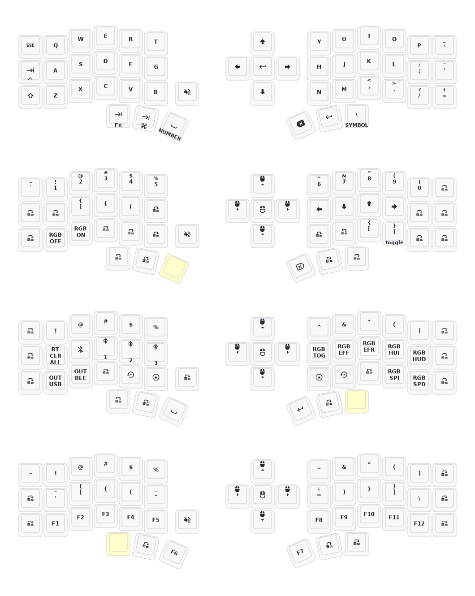

- [Chinese](README.md)
- [English](README_EN.md)

# 睫毛外设 (Eyelash Peripherals) Corne ZMK Repository

**This keyboard is not the same as [foostan's Corne](https://github.com/foostan/crkbd). It will not work with standard `corne` firmware.**

If you need a 3D model of this keyboard, email `380465425@qq.com`.
2025.8.22 update the soft off.When you press the keys Q, S and Z simultaneously and hold them for 2 seconds, the keyboard will enter a deep sleep state and cannot be awakened by pressing the keys. This function can be used when carrying it outside. The activation method is to press the reset switch once.This month, I also updated the ultra-thin versions of the corne and sofle cases. The frame and base plate have been thickened, and the opening of the reset switch has been adjusted, so that the reset switch can be easily pressed. At present, we are still conceptualizing how to design the shell with an inclined bracket.If you have carefully examined a PCB, you will notice that there are reserved interfaces for expansion IO. I wonder if anyone has been able to utilize them,I will try it！

## Instructions

1. [Fork this repository](https://docs.github.com/en/get-started/quickstart/fork-a-repo#forking-a-repository).
2. [Click the **Actions** tab and make sure the workflow is enabled](https://docs.github.com/en/actions/managing-workflow-runs-and-deployments/managing-workflow-runs/disabling-and-enabling-a-workflow#enabling-a-workflow).
3. Make sure the `eyelash_corne` project in [`config/west.yml`](config/west.yml) still works. The `boards/arm/eyelash_corne` folder will be downloaded from this URL.
4. If there is still a `boards/arm/eyelash_corne` folder in your fork, delete it.

**If you already have a ZMK config repository, [you can add this one as a module instead of forking](https://zmk.dev/docs/features/modules#building-with-modules).**

## Keymap Diagram

